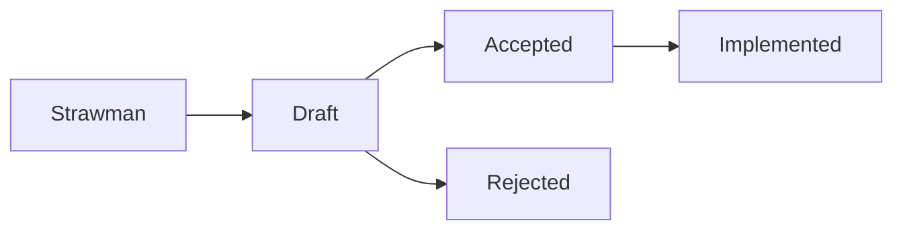

# Contributing to pgai

Thank you for your interest in contributing to the Timescale [pgai](https://github.com/timescale/pgai) project! This guide outlines the process for reporting issues, proposing features, and submitting pull requests.

We appreciate any help the community can provide to make pgai better!

## How to Contribute

### Report Issues
If you encounter any bugs or have suggestions for improvements, please submit an issue through the [GitHub issue tracker](https://github.com/timescale/pgai/issues). Include as much detail as possible to help us understand and resolve the problem.

### Propose Features
We welcome proposals for new features! Before starting work on a significant feature (regardless if you are willing to code), please follow the RFC process detailed below. This helps ensure community alignment and avoids duplication of effort.

## Request for Comments (RFC) Process

For significant changes or new features, we use an RFC process to gather feedback and build consensus. Below are the stages of the RFC process:

### RFC Stages

1. **Strawman**:
   - A preliminary idea presented for discussion.
   - The goal is to identify high-level feasibility, scope, and alignment with project goals.
   - Strawman proposals can be submitted as an issue or draft pull request with a summary of the idea.
   - **Entrance criteria**:
     - Clear explanation of problem and solution.
     - Illustrative examples.
     - Incomplete code changes.
     - Identification of potential concerns, challenges, and drawbacks.

2. **Draft**:
   - A more detailed proposal based on feedback from the strawman phase.
   - Includes technical details, diagrams, and expected outcomes.
   - Drafts are reviewed by maintainers and the community.
   - Updates to the draft occur as new feedback is incorporated.
   - **Entrance criteria**:
     - Consensus the solution is preferred.
     - Resolution of identified concerns and challenges.
     - Precisely described with accurate code changes or examples.

3. **Accepted**:
   - The RFC is formally approved and ready for implementation.
   - Specific tasks and milestones are outlined for execution.
   - **Entrance criteria**:
     - Consensus the solution is complete.
     - Complete changes, including tests, documentation, and examples.

4. **Rejected**:
   - If the RFC is deemed unsuitable, it is rejected with clear reasoning provided.

5. **Implemented**:
   - Once the proposal is successfully implemented and merged into the project.

Each RFC stage builds on community engagement and ensures that proposed features or changes align with project goals.
Maintainers will assign the right stage of Issues and PR's through GitHub labels.

## Contribute code

### Contributor License Agreement (CLA)

Before we accept any code contributions, pgai contributors need to sign the [Contributor License Agreement (CLA)](https://cla-assistant.io/timescale/pgai). By signing a CLA, we ensure that the community is free and confident in its ability to use your contributions.

### Create a Pull Request:

Once your RFC is accepted (and in the case you didn't open a PR yet), or for smaller changes that do not require the RFC process, you are ready to open a PR.
Please strictly follow the guidelines below:

1. Fork the repository and create a new branch for your work.
2. Write clean, well-documented, and tested code.
3. Ensure that your code adheres to the project's style and guidelines. 
4. Include relevant tests and documentation updates.
5. Don't mix bug fixes with unrelated feature enhancements or stylistical changes.
6. The project uses [conventional commits][https://www.conventionalcommits.org]. It's enforced by CI, you won't be able to merge PRs if your commits do not comply. This helps us automate the release process, changelog generation, etc. For example:
  - If the commit fixes bug 123, add a line at the end of the commit message with  `Fixes #123`.
  - If the commit implements feature request 321, add a line at the end of the commit message `Closes #321`.
7. Clearly explain the purpose of the PR and link to related issues or RFCs.
8. Ensure that your changes pass all CI checks.

Please refer to our DEVELOPMENT doc for [instructions how to develop and test](https://github.com/timescale/pgai/blob/main/DEVELOPMENT.md).

## Testing

Every non-trivial change to the code base should be accompanied by a
relevant addition to or modification of the test suite.

Please check that the full test suite (including your test additions
or changes) passes successfully on your local machine **before you
open a pull request**.

See our [testing](./DEVELOPMENT.md#test-your-pgai-changes)
instructions for help with how to test.

## License

By contributing to this repository, you agree that your contributions will be licensed under the same license as the project.

We appreciate your time and effort in making Timescale pgai better. Happy coding!
