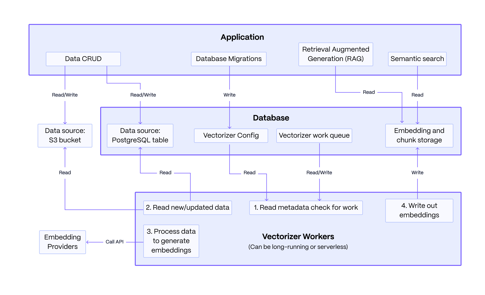

<p align="center">
    
    
</p>

<div align=center>

<h3>Power your RAG and Agentic applications with PostgreSQL</h3>

<div>
  <a href="https://github.com/timescale/pgai/tree/main/docs"><strong>Docs</strong></a> ·
  <a href="https://discord.gg/KRdHVXAmkp"><strong>Join the pgai Discord!</strong></a> ·
  <a href="https://tsdb.co/gh-pgai-signup"><strong>Try timescale for free!</strong></a> ·
  <a href="https://github.com/timescale/pgai/releases"><strong>Changelog</strong></a>
</div>
</div>
<br/>

A Python library that transforms PostgreSQL into a robust, production-ready retrieval engine for RAG and Agentic applications.

- 🔄 Automatically create and synchronize vector embeddings from PostgreSQL data and S3 documents. Embeddings update automatically as data changes.

- 🔍 Powerful vector and semantic search with pgvector and pgvectorscale.

- 🛡️ Production-ready out-of-the-box: Supports batch processing for efficient embedding generation, with built-in handling for model failures, rate limits, and latency spikes.

- 🐘 Works with any PostgreSQL database, including Timescale Cloud, Amazon RDS, Supabase and more.


**Basic Architecture**:
The system consists of an application you write, a PostgreSQL database, and stateless vectorizer workers. The application defines a vectorizer configuration to embed data from sources like PostgreSQL or S3. The workers read this configuration, processes the data queue into embeddings and chunked text, and writes the results back. The application then queries this data to power RAG and semantic search.

The key strength of this architecture lies in its resilience: data modifications made by the application are decoupled from the embedding process, ensuring that failures in the embedding service do not affect the core data operations.
    
<div align=center>



</div>

### install 

First, install the pgai package.

```
pip install pgai
```              

Then, install the pgai database components. You can do this from the terminal using the CLI or in your Python application code using the pgai python package.
```
# from the cli
pgai install -d <database-url>

# or from the python package, often done as part of your application setup
import pgai
pgai.install(DB_URL)
```


# Quick Start

This quickstart demonstrates how pgai Vectorizer enables semantic search and RAG over PostgreSQL data by automatically creating and synchronizing embeddings as data changes.

The key "secret sauce" of pgai Vectorizer is its declarative approach to
embedding generation. Simply define your pipeline and let Vectorizer handle the
operational complexity of keeping embeddings in sync, even when embedding
endpoints are unreliable. You can define a simple version of the pipeline as
follows:

```sql
CREATE TABLE IF NOT EXISTS wiki (
    id INTEGER PRIMARY KEY GENERATED ALWAYS AS IDENTITY,
    url TEXT NOT NULL,
    title TEXT NOT NULL,
    text TEXT NOT NULL
)

SELECT ai.create_vectorizer(
     'wiki'::regclass,
     loading => ai.loading_column(column_name=>'text'),
     destination => ai.destination_table(target_table=>'wiki_embedding_storage'),
     embedding => ai.embedding_openai(model=>'text-embedding-ada-002', dimensions=>'1536')
    )
```

The vectorizer will automatically create embeddings for all the rows in the
`wiki` table, and, more importantly, will keep the embeddings synced with the
underlying data as it changes.  **Think of it almost like declaring an index** on
the `wiki` table, but instead of the database managing the index datastructure
for you, the Vectorizer is managing the embeddings. 

## Running the quick start

**Prerequisites:**
- A PostgreSQL database ([docker instructions](https://docs.timescale.com/self-hosted/latest/install/installation-docker/)).
- An OpenAI API key (we use openai for embedding in the quick start, but you can use [multiple providers](#supported-embedding-models)).

Create a `.env` file with the following:

```
OPENAI_API_KEY=<your-openai-api-key>
DB_URL=<your-database-url>
```

You can download the full [python code](examples/quickstart/main.py) and [requirements.txt](examples/quickstart/requirements.txt) from the quickstart example and run it in the same directory as the `.env` file.

<details>
<summary>Click here for a bash script to run the quickstart</summary>

```bash
curl -O https://raw.githubusercontent.com/timescale/pgai/main/examples/quickstart/main.py
curl -O https://raw.githubusercontent.com/timescale/pgai/main/examples/quickstart/requirements.txt
python -m venv venv
source venv/bin/activate
pip install -r requirements.txt
python main.py
```
</details>
Sample output:

<details>
<summary>Click to expand sample output</summary>

```
Search results 1:
[WikiSearchResult(id=7,
                  url='https://en.wikipedia.org/wiki/Aristotle',
                  title='Aristotle',
                  text='Aristotle (;  Aristotélēs, ; 384–322\xa0BC) was an '
                       'Ancient Greek philosopher and polymath. His writings '
                       'cover a broad range of subjects spanning the natural '
                       'sciences, philosophy, linguistics, economics, '
                       'politics, psychology and the arts. As the founder of '
                       'the Peripatetic school of philosophy in the Lyceum in '
                       'Athens, he began the wider Aristotelian tradition that '
                       'followed, which set the groundwork for the development '
                       'of modern science.\n'
                       '\n'
                       "Little is known about Aristotle's life. He was born in "
                       'the city of Stagira in northern Greece during the '
                       'Classical period. His father, Nicomachus, died when '
                       'Aristotle was a child, and he was brought up by a '
                       "guardian. At 17 or 18 he joined Plato's Academy in "
                       'Athens and remained there till the age of 37 (). '
                       'Shortly after Plato died, Aristotle left Athens and, '
                       'at the request of Philip II of Macedon, tutored his '
                       'son Alexander the Great beginning in 343 BC. He '
                       'established a library in the Lyceum which helped him '
                       'to produce many of his hundreds of books on papyru',
                  chunk='Aristotle (;  Aristotélēs, ; 384–322\xa0BC) was an '
                        'Ancient Greek philosopher and polymath. His writings '
                        'cover a broad range of subjects spanning the natural '
                        'sciences, philosophy, linguistics, economics, '
                        'politics, psychology and the arts. As the founder of '
                        'the Peripatetic school of philosophy in the Lyceum in '
                        'Athens, he began the wider Aristotelian tradition '
                        'that followed, which set the groundwork for the '
                        'development of modern science.',
                  distance=0.22242502364217387)]
Search results 2:
[WikiSearchResult(id=41,
                  url='https://en.wikipedia.org/wiki/pgai',
                  title='pgai',
                  text='pgai is a Python library that turns PostgreSQL into '
                       'the retrieval engine behind robust, production-ready '
                       'RAG and Agentic applications. It does this by '
                       'automatically creating vector embeddings for your data '
                       'based on the vectorizer you define.',
                  chunk='pgai is a Python library that turns PostgreSQL into '
                        'the retrieval engine behind robust, production-ready '
                        'RAG and Agentic applications. It does this by '
                        'automatically creating vector embeddings for your '
                        'data based on the vectorizer you define.',
                  distance=0.13639101792546204)]
RAG response:
The main thing pgai does right now is generating vector embeddings for data in PostgreSQL databases based on the vectorizer defined by the user, enabling the creation of robust RAG and Agentic applications.
```
</details>


## Code walkthrough

### Install the pgai database components

Pgai requires a few catalog tables and functions to be installed into the database. This is done using the `pgai.install` function, which will install the necessary components into the `ai` schema of the database.

```python
pgai.install(DB_URL)
```

### Create the vectorizer

This defines the vectorizer, which tells the system how to create the embeddings from the `text` column in the `wiki` table. The vectorizer creates a view `wiki_embedding` that we can query for the embeddings (as we'll see below).

```python
async def create_vectorizer(conn: psycopg.AsyncConnection):
    async with conn.cursor() as cur:    
        await cur.execute("""
            SELECT ai.create_vectorizer(
                'wiki'::regclass,
                if_not_exists => true,
                loading => ai.loading_column(column_name=>'text'),
                embedding => ai.embedding_openai(model=>'text-embedding-ada-002', dimensions=>'1536'),
                destination => ai.destination_table(view_name=>'wiki_embedding')
            )
        """)   
    await conn.commit()
```

### Run the vectorizer worker


In this example, we run the vectorizer worker once to create the embeddings for the existing data.

```python
worker = Worker(DB_URL, once=True)
worker.run()
```

In a real application, we would not call the worker manually like this every time we want to create the embeddings. Instead, we would run the worker in the background and it would run continuously, polling for work from the vectorizer. 

You can run the worker in the background from the application, the cli, or docker. See the [vectorizer worker](/docs/vectorizer/worker.md) documentation for more details.


### Search the wiki articles using semantic search

This is standard pgvector semantic search in PostgreSQL. The search is performed against the `wiki_embedding` view, which is created by the vectorizer and includes all the columns from the `wiki` table plus the `embedding` column and the chunk text. This function returns both the entire `text` column from the `wiki` table and smaller chunks of the text that are most relevant to the query.


```python
@dataclass
class WikiSearchResult:
    id: int
    url: str
    title: str
    text: str
    chunk: str
    distance: float

async def _find_relevant_chunks(client: AsyncOpenAI, query: str, limit: int = 1) -> List[WikiSearchResult]:
    # Generate embedding for the query using OpenAI's API
    response = await client.embeddings.create(
        model="text-embedding-ada-002",
        input=query,
        encoding_format="float",
    )
    
    embedding = np.array(response.data[0].embedding)
    
    # Query the database for the most similar chunks using pgvector's cosine distance operator (<=>)
    async with pool.connection() as conn:
        async with conn.cursor(row_factory=class_row(WikiSearchResult)) as cur:
            await cur.execute("""
                SELECT w.id, w.url, w.title, w.text, w.chunk, w.embedding <=> %s as distance
                FROM wiki_embedding w
                ORDER BY distance
                LIMIT %s
            """, (embedding, limit))
            
            return await cur.fetchall()
```

### Insert a new article into the wiki table

This code is notable for what it is not doing. This is a simple insert of a new article into the `wiki` table. We did not need to do anything different to create the embeddings, the vectorizer worker will take care of updating the embeddings as the data changes.

```python
def insert_article_about_pgai(conn: psycopg.AsyncConnection):
    async with conn.cursor(row_factory=class_row(WikiSearchResult)) as cur:
        await cur.execute("""
            INSERT INTO wiki (url, title, text) VALUES
            ('https://en.wikipedia.org/wiki/pgai', 'pgai', 'pgai is a Python library that turns PostgreSQL into the retrieval engine behind robust, production-ready RAG and Agentic applications. It does this by automatically creating vector embeddings for your data based on the vectorizer you define.')
        """)
    await conn.commit() 
```

### Perform RAG with the LLM

This code performs RAG with the LLM. It uses the `_find_relevant_chunks` function defined above to find the most relevant chunks of text from the `wiki` table and then uses the LLM to generate a response.

```python
    query = "What is the main thing pgai does right now?"
    relevant_chunks = await _find_relevant_chunks(client, query)
    context = "\n\n".join(
        f"{chunk.title}:\n{chunk.text}" 
        for chunk in relevant_chunks
    )
    prompt = f"""Question: {query}

Please use the following context to provide an accurate response:   

{context}

Answer:"""

    response = await client.chat.completions.create({
        model: "gpt-4o-mini",
        messages: [{ role: "user", content: prompt }],
    })
    print("RAG response:")
    print(response.choices[0].message.content)
```

## Next steps

Look for other quickstarts:
- Quickstart with FastAPI and psycopg [here](/examples/simple_fastapi_app/README.md)

Explore more about the vectorizer:
- Learn more about the [vectorizer](/docs/vectorizer/overview.md) and the [vectorizer worker](/docs/vectorizer/worker.md)
- dive into the vectorizer api [reference](/docs/vectorizer/api-reference.md)

# Features 

Our pgai Python library lets you work with embeddings generated from your data:

* Automatically create and sync vector embeddings for your data using the [vectorizer](/docs/vectorizer/overview.md).
* [Load data](/docs/vectorizer/api-reference.md#loading-configuration) from a column in your table or from a file, s3 bucket, etc.
* Create multiple embeddings for the same data with different models and parameters for testing and experimentation.
* [Customize](#a-configurable-vectorizer-pipeline) how your embedding pipeline parses, chunks, formats, and embeds your data.

You can use the vector embeddings to:
- [Perform semantic search](/docs/vectorizer/overview.md#query-an-embedding) using pgvector.
- Implement Retrieval Augmented Generation (RAG)
- Perform high-performance, cost-efficient ANN search on large vector workloads with [pgvectorscale](https://github.com/timescale/pgvectorscale), which complements pgvector.


We also offer a [PostgreSQL extension](/projects/extension/README.md) that can perform LLM model calling directly from SQL. This is often useful for use cases like classification, summarization, and data enrichment on your existing data.

## A configurable vectorizer pipeline

The vectorizer is designed to be flexible and customizable. Each vectorizer defines a pipeline for creating embeddings from your data. The pipeline is defined by a series of components that are applied in sequence to the data:

- **[Loading](/docs/vectorizer/api-reference.md#loading-configuration):** First, you define the source of the data to embed. It can be the data stored directly in a column of the source table or a URI referenced in a column of the source table that points to a file, s3 bucket, etc.
- **[Parsing](/docs/vectorizer/api-reference.md#parsing-configuration):** Then, you define the way the data is parsed if it is a non-text document such as a PDF, HTML, or markdown file.
- **[Chunking](/docs/vectorizer/api-reference.md#chunking-configuration):** Next, you define the way text data is split into chunks.
- **[Formatting](/docs/vectorizer/api-reference.md#formatting-configuration):** Then, for each chunk, you define the way the data is formatted before it is sent for embedding. For example, you can add the title of the document as the first line of the chunk.
- **[Embedding](/docs/vectorizer/api-reference.md#embedding-configuration):** Finally, you specify the LLM provider, model, and the parameters to be used when generating the embeddings.

## Supported embedding models

The following models are supported for embedding:

- [Ollama](/docs/vectorizer/api-reference.md#aiembedding_ollama)
- [OpenAI](/docs/vectorizer/api-reference.md#aiembedding_openai)
- [Voyage AI](/docs/vectorizer/api-reference.md#aiembedding_voyageai)
- [Cohere](/docs/vectorizer/api-reference.md#aiembedding_litellm)
- [Huggingface](/docs/vectorizer/api-reference.md#aiembedding_litellm)
- [Mistral](/docs/vectorizer/api-reference.md#aiembedding_litellm)
- [Azure OpenAI](/docs/vectorizer/api-reference.md#aiembedding_litellm)
- [AWS Bedrock](/docs/vectorizer/api-reference.md#aiembedding_litellm)
- [Vertex AI](/docs/vectorizer/api-reference.md#aiembedding_litellm)

## The devil is in the error handling

Simply creating vector embeddings is easy and straightforward. The challenge is
that LLMs are somewhat unreliable and the endpoints exhibit intermittent
failures and/or degraded performance. A critical part of properly handling
failures is that your primary data-modification operations (INSERT, UPDATE,
DELETE) should not be dependent on the embedding operation. Otherwise, your
application will be down every time the endpoint is slow or fails and your user
experience will suffer.

Normally, you would need to implement a custom MLops pipeline to properly handle
endpoint failures. This commonly involves queuing system like Kafka, specialized
workers, and other infrastructure for handling the queue and retrying failed
requests. This is a lot of work and it is easy to get wrong.

With pgai, you can skip all that and focus on building your application because
the vectorizer is managing the embeddings for you. We have built in queueing and
retry logic to handle the various failure modes you can encounter. Because we do
this work in the background, the primary data modification operations are not
dependent on the embedding operation. This is why pgai is production-ready out of the box.

Many specialized vector databases create embeddings for you. However, they typically fail when embedding endpoints are down or degraded, placing the burden of error handling and retries back on you.

 
# Resources
## Why we built it
- [Vector Databases Are the Wrong Abstraction](https://www.timescale.com/blog/vector-databases-are-the-wrong-abstraction/)
- [pgai: Giving PostgreSQL Developers AI Engineering Superpowers](http://www.timescale.com/blog/pgai-giving-postgresql-developers-ai-engineering-superpowers)

## Quick start guides
- [The quick start with Ollama guide above](#quick-start)
- [Quick start with OpenAI](/docs/vectorizer/quick-start-openai.md)
- [Quick start with VoyageAI](/docs/vectorizer/quick-start-voyage.md)

## Tutorials about pgai vectorizer
- [How to Automatically Create & Update Embeddings in PostgreSQL—With One SQL Query](https://www.timescale.com/blog/how-to-automatically-create-update-embeddings-in-postgresql/)
- [video] [Auto Create and Sync Vector Embeddings in 1 Line of SQL](https://www.youtube.com/watch?v=ZoC2XYol6Zk)
- [Which OpenAI Embedding Model Is Best for Your RAG App With Pgvector?](https://www.timescale.com/blog/which-openai-embedding-model-is-best/)
- [Which RAG Chunking and Formatting Strategy Is Best for Your App With Pgvector](https://www.timescale.com/blog/which-rag-chunking-and-formatting-strategy-is-best/)
- [Parsing All the Data With Open-Source Tools: Unstructured and Pgai](https://www.timescale.com/blog/parsing-all-the-data-with-open-source-tools-unstructured-and-pgai/)


## Contributing
We welcome contributions to pgai! See the [Contributing](/CONTRIBUTING.md) page for more information.


## Get involved

pgai is still at an early stage. Now is a great time to help shape the direction of this project;
we are currently deciding priorities. Have a look at the [list of features](https://github.com/timescale/pgai/issues) we're thinking of working on.
Feel free to comment, expand the list, or hop on the Discussions forum.

To get started, take a look at [how to contribute](./CONTRIBUTING.md)
and [how to set up a dev/test environment](./DEVELOPMENT.md).

## About Timescale

Timescale is a PostgreSQL database company. To learn more visit the [timescale.com](https://www.timescale.com).

Timescale Cloud is a high-performance, developer focused, cloud platform that provides PostgreSQL services
for the most demanding AI, time-series, analytics, and event workloads. Timescale Cloud is ideal for production applications and provides high availability, streaming backups, upgrades over time, roles and permissions, and great security.

[pgai-plpython]: https://github.com/postgres-ai/postgres-howtos/blob/main/0047_how_to_install_postgres_16_with_plpython3u.md
[asdf-postgres]: https://github.com/smashedtoatoms/asdf-postgres
[asdf]: https://github.com/asdf-vm/asdf
[python3]: https://www.python.org/downloads/
[pip]: https://pip.pypa.io/en/stable/installation/#supported-methods
[plpython3u]: https://www.postgresql.org/docs/current/plpython.html
[pgvector]: https://github.com/pgvector/pgvector
[pgvector-install]: https://github.com/pgvector/pgvector?tab=readme-ov-file#installation
[python-virtual-environment]: https://packaging.python.org/en/latest/tutorials/installing-packages/#creating-and-using-virtual-environments
[create-a-new-service]: https://console.cloud.timescale.com/dashboard/create_services
[just]: https://github.com/casey/just
