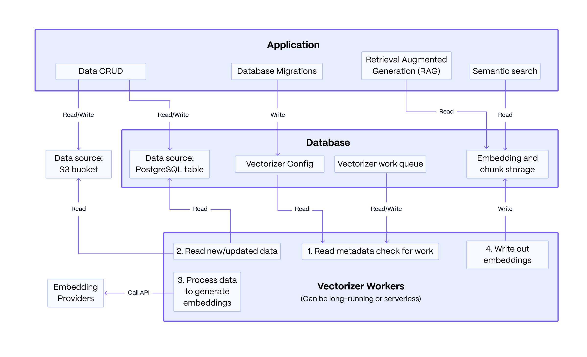

# pgai documentation

This is the central documentation hub for pgai, a Python library that turns PostgreSQL into the retrieval engine behind robust, production-ready RAG and Agentic applications.

## Overview

pgai offers these key capabilities:

- 🔄 **Automatic vector embeddings**: Create and synchronize vector embeddings from PostgreSQL data and documents in S3, with automatic updates as data changes.

- 🔍 **Powerful search**: Use pgvector and pgvectorscale for efficient vector and semantic search.

- 🛡️ **Production-ready**: Built-in handling for model failures, rate limits, and latency spikes with batch processing for efficient embedding generation.

- 🐘 **Works with any PostgreSQL**: Compatible with Timescale Cloud, Amazon RDS, Supabase, and more.



## Installation

```bash
# Install the pgai Python library
pip install pgai

# Setup database components
python -c "import pgai; pgai.install('your-database-url')"
```

All pgai database objects are installed in the `ai` schema.

## Documentation index

### Getting started
- **Quick start guides**:
  - [Vectorizer with Ollama](/docs/vectorizer/quick-start.md) - Use pgai with self-hosted models
  - [Vectorizer with OpenAI](/docs/vectorizer/quick-start-openai.md) - Use pgai with OpenAI's embedding models
  - [Vectorizer with VoyageAI](/docs/vectorizer/quick-start-voyage.md) - Use pgai with Voyage AI

### Extension
- [pgai extension documentation](/projects/extension/README.md).

### Vectorizer
- [Vectorizer Documentation](/docs/vectorizer/README.md) - Understand how Vectorizer works and its features
- [Document Embeddings](/docs/vectorizer/README.md#document-embedding) - Generate embeddings from documents (i.e. stored in AWS S3 buckets)
- [Vectorizer API Reference](/docs/vectorizer/api-reference.md) - Complete reference for all Vectorizer functions
- [Vectorizer Worker](/docs/vectorizer/worker.md) - Learn how to run vectorizers in production environments

### Integration
- [SQLAlchemy Integration](/docs/vectorizer/sqlalchemy-integration.md) - Use pgai with SQLAlchemy
- [Alembic Integration](/docs/vectorizer/alembic-integration.md) - Manage migrations with Alembic
- [Python Integration](/docs/vectorizer/python-integration.md) - General Python integration guidelines
- [Migrating from Extension](/docs/vectorizer/migrating-from-extension.md) - Migrate from the previous extension-based approach

### Development
- [Adding Embedding Integrations](/docs/vectorizer/adding-embedding-integration.md) - Guide for adding new embedding model providers

## Getting help

- [Join our Discord](https://discord.gg/KRdHVXAmkp) for community support
- [GitHub Issues](https://github.com/timescale/pgai/issues) for bug reports and feature requests