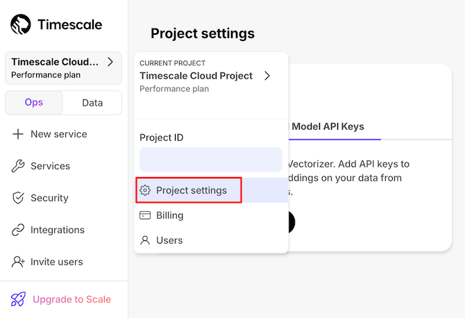
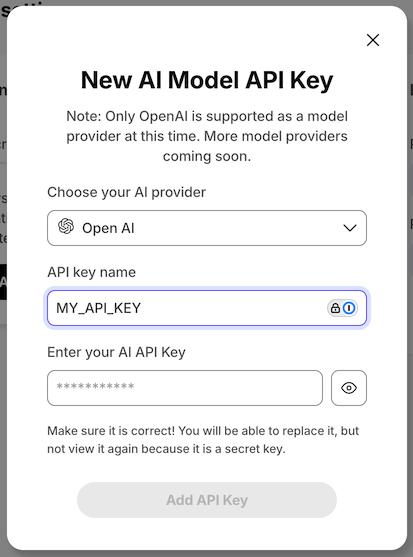

# Handling API keys

A number of pgai functions call out to third-party APIs which require an API
key for authentication. There are a few ways to pass your API key to these
functions. This document lays out the different options and provides
recommendations for which option to use.

## pgai and API keys

All pgai functions that require an API key take two optional parameters:
`api_key_name`, and `api_key`. If neither parameter is provided, the function
will fall back to a default name and attempt to extract an API key with that
name. TODO: is this clear?

We suggest that you generally prefer using `api_key_name`, as it is harder to
misuse.

### Using the `api_key` parameter

When you use the `api_key` parameter, you pass the API key as a plain text
value to the function. This is simple to use, but results in the API key being
printed to the PostgreSQL logs. For this reason we DO NOT recommend this method.

It is safe pass the `api_key` parameter as a bind variable:

1. Set the API key as an environment variable in your shell:
    ```bash
    export MY_API_KEY="this-is-my-super-secret-api-key-dont-tell"
    ```

2. Connect to your database and set your api key as a [psql variable](https://www.postgresql.org/docs/current/app-psql.html#APP-PSQL-VARIABLES):

      ```bash
      psql -d "postgres://<username>:<password>@<host>:<port>/<database-name>" -v my_api_key=$MY_API_KEY
      ```
   Your API key is now available as a psql variable named `my_api_key` in your psql session.

   You can also log into the database, then set `my_api_key` using the `\getenv` [metacommand](https://www.postgresql.org/docs/current/app-psql.html#APP-PSQL-META-COMMAND-GETENV):

      ```sql
      \getenv my_api_key MY_API_KEY
      ```

3. Pass your API key to your parameterized query:
    ```sql
    SELECT *
    FROM ai.openai_list_models(api_key=>$1)
    ORDER BY created DESC
    \bind :my_api_key
    \g
    ```

### Using the `api_key_name` parameter

When you use the `api_key_name` parameter, you pass the name of a
previously-defined API key to the pgai function. The function extracts the value
of the API key and uses it in the call to the third-party API:

```sql
SELECT * FROM ai.openai_list_models(api_key_name => 'MY_API_KEY');
```

## Configuring an API key for use with `api_key_name`

There are four ways to configure an API key:

- In the Timescale Cloud Project settings
- In an interactive psql session
- As an environment variable available to the Postgres process (for self-hosted)
- As an environment variable available to the Vectorizer worker process (for self-hosted vectorizer worker)

### Configure an API key in Timescale Cloud

1. Navigate to the "AI Model API Keys" tab under "Project settings"

   

1. Add a new AI Model API key, providing the name and API key
 
   

1. Use this API key name in calls to pgai functions, like so:
    ```sql
    SELECT * FROM ai.openai_list_models(api_key_name => 'MY_API_KEY');
    ```

### Configure an API key for an interactive psql session

To use a [session level parameter when connecting to your database with psql](https://www.postgresql.org/docs/current/config-setting.html#CONFIG-SETTING-SHELL)
to run your AI queries:

1. Set the api key as an environment variable in your shell:
    ```bash
    export MY_API_KEY="this-is-my-super-secret-api-key-dont-tell"
    ```

1. Use the session level parameter when you connect to your database:

    ```bash
    PGOPTIONS="-c ai.my_api_key=$MY_API_KEY" psql -d "postgres://<username>:<password>@<host>:<port>/<database-name>"
    ```

1. Run your AI query:

    ```sql
    SELECT * FROM ai.voyageai_embed('voyage-3-lite', 'sample text to embed', api_key_name => 'my_api_key');
    ```

### Configure an API key through an environment variable available to the Postgres process (self-hosted)

If you're running PostgreSQL yourself, or have the ability to configure the
runtime of PostgreSQL, you set an environment variable for the PostgreSQL
process.

Two examples of this are with Docker, or with Systemd.

#### Configure environment variable with docker

```sh
docker run -e MY_API_KEY=<api key here> ... timescale/timescaledb-ha...
```

#### Configure environment variable in Systemd unit

In the `[Service]` stanza of the Systemd unit, add:

```
Environment=MY_API_KEY=<api key here>
```

### Configure an environment variable available to the Vectorizer worker process (for self-hosted vectorizer worker)

The self-hosted vectorizer worker is a standalone process that you run. The
vectorizer worker automatically retrieves API keys from the database it
connects to, but you can also set environment variables for the vectorizer
worker process.

If you've installed the self-hosted vectorizer via pip, then you set an
API key environment variable like this:

```sh
MY_API_KEY=<api key here> pgai vectorizer worker ... 
```

If you're running the self-hosted vectorizer docker image, then you set and
API key environment variable like this:

```sh
docker run -e MY_API_KEY=<api_key_here> timescale/pgai-vectorizer-worker ...
```

