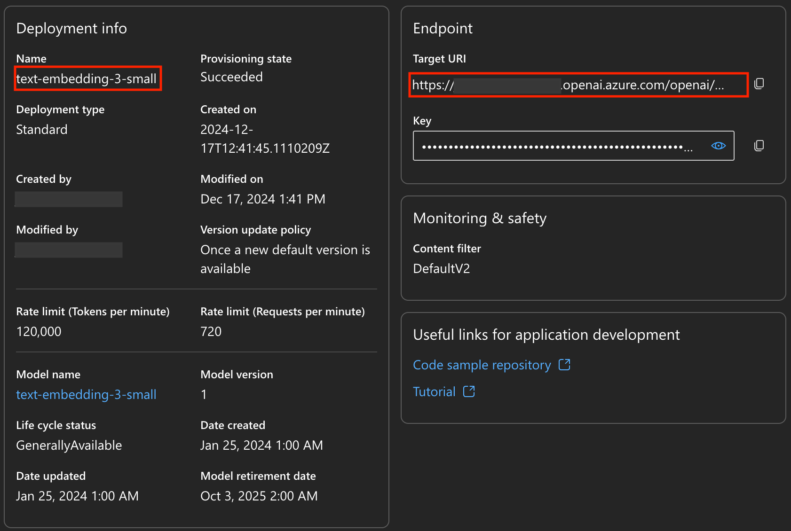

# Use pgai with LiteLLM

This page shows you how to:

- [Configure pgai for LiteLLM](#configure-pgai-for-litellm)
- [Use LiteLLM for vector embeddings](#usage)

## Configure pgai for LiteLLM

LiteLLM provides access to AI models of multiple providers. To use a provider's API, you must
first obtain an API key for that provider.

In production, we suggest setting the API key using an environment variable.
During testing and development, it may be easiest to configure the key value
as a [session level parameter]. For more options and details, consult the
[Handling API keys](./handling-api-keys.md) document.

[session level parameter]: https://www.postgresql.org/docs/current/config-setting.html#CONFIG-SETTING-SHELL


1. Set your Provider API key as an environment variable in your shell:
    ```bash
    export OPENAI_API_KEY="this-is-my-super-secret-api-key-dont-tell"
    ```

1. Use the session level parameter when you connect to your database:

    ```bash
    PGOPTIONS="-c ai.openai_api_key=$OPENAI_API_KEY" psql -d "postgres://<username>:<password>@<host>:<port>/<database-name>"
    ```

1. Run your AI query:

   `ai.openai_api_key` is set for the duration of your psql session.

    ```sql
    SELECT ai.litellm_embed('<provider>/<model>', 'Hello world', api_key_name => 'OPENAI_API_KEY');
    ```

Note: Because there is no sensible default api key name with LiteLLM, the
`api_key_name` parameter must be specified when used with the session level
parameter.
If you have configured the database to have access to the provider's API key
through an appropriately-named environment variable (e.g. `OPENAI_API_KEY`)
then the LiteLLM client library will automatically extract it from the
environment, so it is not necessary to explicitly pass the `api_key_name`
parameter.

## Embed

Generate embeddings using a specified model.

- Request an embedding using a specific model:

    ```sql
    SELECT ai.litellm_embed
    ( 'openai/text-embedding-3-small'
    , 'the purple elephant sits on a red mushroom'
    , api_key_name => 'OPENAI_API_KEY'
    );
    ```

  The data returned looks like:

    ```text
                          litellm_embed                      
    --------------------------------------------------------
     [0.005978798,-0.020522336,...-0.0022857306,-0.023699166]
    (1 row)
    ```

- Specify the number of dimensions you want in the returned embedding:

    ```sql
    SELECT ai.litellm_embed
    ( 'openai/text-embedding-3-small'
    , 'the purple elephant sits on a red mushroom'
    , dimensions=>768
    , api_key_name => 'OPENAI_API_KEY'
    );
    ```
  This only works for certain models.

- Pass a user identifier:

    ```sql
    SELECT ai.litellm_embed
    ( 'openai/text-embedding-3-small'
    , 'the purple elephant sits on a red mushroom'
    , api_key_name => 'OPENAI_API_KEY'
    , extra_options => '{"openai_user" : "bac1aaf7-4460-42d3-bba5-2957b057f4a5"}'::jsonb
    );
    ```

- Pass an array of text inputs:

    ```sql
    SELECT * FROM ai.litellm_embed
    ( 'openai/text-embedding-3-small'
    , array['Timescale is Postgres made Powerful', 'the purple elephant sits on a red mushroom']
    );
    ```

### Provider-specific usage

The following section provides examples and notes on individual providers supported by LiteLLM.

#### Cohere

```sql
    SELECT ai.litellm_embed(
      'cohere/embed-english-v3.0'
    , 'Timescale is Postgres made Powerful'
    );
```

Note: The [Cohere documentation on input_type] specifies that the `input_type` parameter is required.
By default, LiteLLM sets this to `search_document`. The input type can be provided
via `extra_options`, i.e. `extra_options => '{"input_type": "search_document"}'::jsonb`.

[Cohere documentation on input_type]: https://docs.cohere.com/v2/docs/embeddings#the-input_type-parameter

#### Mistral

```sql
    SELECT ai.litellm_embed(
      'mistral/mistral-embed'
    , 'Timescale is Postgres made Powerful'
    );
```

Note: Mistral limits the maximum input per batch to 16384 tokens.

#### Azure OpenAI

To get embeddings with Azure OpenAI you require these values from the Azure AI Foundry console:
- deployment name
- base URL
- version
- API key

The deployment name is visible in the "Deployment info" section. The base URL and version are
extracted from the "Target URI" field in the "Endpoint section". The Target URI has the form:
`https://your-resource-name.openai.azure.com/openai/deployments/your-deployment-name/embeddings?api-version=2023-05-15`.
In this example, the base URL is: `https://your-resource-name.openai.azure.com` and the version is `2023-05-15`.



Obtain embeddings as follows, note that the base URL and version are configured through `extra_options`:

```sql
    SELECT ai.litellm_embed
    ( 'azure/<deployment name here>'
    , 'Timescale is Postgres made Powerful'
    , api_key_name => 'AZURE_API_KEY',
    , extra_options => '{"api_base": "<base URL here>", "api_version": "<version here">}'::jsonb
    );
```

#### Huggingface inference models

You can use [Huggingface inference] to obtain vector embeddings. Note that
Huggingface has two categories of inference: "serverless inference", and
"inference endpoints". Serverless inference is free, but is limited to models
under 10GB in size, and the model may not be immediately available to serve
requests. Inference endpoints are a paid service and provide always-on APIs
for production use-cases.

When using serverless inference, you can pass the additional parameter
`wait_for_model` to force the call to block until the model has been loaded.

```sql
    SELECT ai.litellm_embed
    ( 'huggingface/BAAI/bge-small-en-v1.5'
    , 'Timescale is Postgres made Powerful'
    , extra_options => '{"wait_for_model": true}'::jsonb
    );
```

[Huggingface inference]: https://huggingface.co/docs/huggingface_hub/en/guides/inference

#### AWS Bedrock

You can use LiteLLM to obtain embeddings with AWS Bedrock. LiteLLM uses boto3
under the hood, so there are multiple ways to authenticate.

The simplest method is to set the `AWS_ACCESS_KEY_ID`, `AWS_SECRET_ACCESS_KEY`,
and `AWS_REGION_NAME` environment variables for the database process. Consult
the [boto3 credentials documentation] for more options.

[boto3 credentials documentation]: (https://boto3.amazonaws.com/v1/documentation/api/latest/guide/credentials.html)

```sql
    SELECT ai.litellm_embed(
      'bedrock/amazon.titan-embed-text-v2:0'
    , 'Timescale is Postgres made Powerful'
    );
```

#### Vertex AI

You can use LiteLLM to obtain embeddings with Vertex AI. LiteLLM uses Google
Cloud Platform's authentication under the hood, so there are multiple ways to
authenticate.

The simplest method is to provide the `VERTEX_PROJECT`, and
`VERTEX_CREDENTIALS` environment variables to the database process. These
correspond to the project id, and the path to a file containing credentials for
a service account. Consult the [Authentication methods at Google] for more
options.

[Authentication methods at Google]: https://cloud.google.com/docs/authentication

```sql
    SELECT ai.litellm_embed(
      'vertex_ai/text-embedding-005',
    , 'Timescale is Postgres made Powerful'
    );
```

Note: `VERTEX_CREDENTIALS` should contain the path to a file containing the API
key, the database process must have access to this file in order to load the
credentials.
