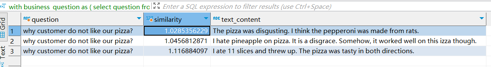
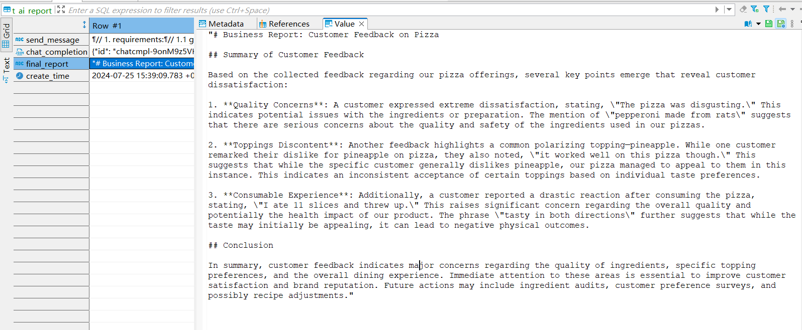
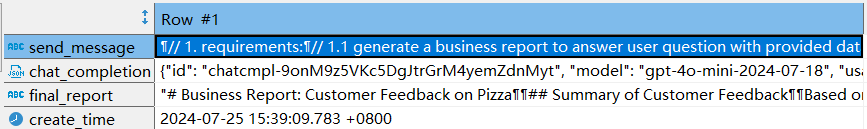

# Enhancing Customer Satisfaction in Pizza Shops with RAG — A deep dive of pgai case study

Hello, this is ([Yong Wang | LinkedIn](https://www.linkedin.com/in/yong-wang-4695221b/)). 

I am a business analyst focused on waste to energy plant digital transformation. Recently I join the pgai contribution and want to share a pgai rag user case with you. 

This blog aims to provide technical users with a business value, rag concept and detailed implementation steps, demonstrating how to employ pgai, large language model effectively in a virtual pizza shop case. 

## 1. Executive Summary
In this blog, we explore how integrating pgai with aigc and ChatGPT 4.0 can transform customer relationship management (CRM) in the pizza industry. By leveraging AI-driven insights, we demonstrate how to enhance customer satisfaction and operational efficiency in a virtual pizza shop scenario.

## 2. Introduction
The integration of Artificial Intelligence in General Computing (aigc) is revolutionizing business practices. This blog showcases the application of ChatGPT and pgai, an AI-enabled database, to improve customer interactions and obtain real-time insights.

## 3 Case Study: Enhancing Customer Satisfaction in a Virtual Pizza Shop

As a business analyst, you want to know why recently sell order drops from customer feedback database recently and delivery a business report for management improvement. So, you give pgai a question by a SQL
```
why customer do not like our pizza?
```

after few seconds, pgai generated a business report to you as below:
```text
# Business Report: Customer Feedback on Pizza

## Summary of Customer Feedback

Based on the collected feedback regarding our pizza offerings, several key points emerge that reveal customer dissatisfaction:

1. **Quality Concerns**: A customer expressed extreme dissatisfaction, stating, \"The pizza was disgusting.\" This indicates potential issues with the ingredients or preparation. The mention of \"pepperoni made from rats\" suggests that there are serious concerns about the quality and safety of the ingredients used in our pizzas.

2. **Toppings Discontent**: Another feedback highlights a common polarizing topping—pineapple. While one customer remarked their dislike for pineapple on pizza, they also noted, \"it worked well on this pizza though.\" This suggests that while the specific customer generally dislikes pineapple, our pizza managed to appeal to them in this instance. This indicates an inconsistent acceptance of certain toppings based on individual taste preferences.

3. **Consumable Experience**: Additionally, a customer reported a drastic reaction after consuming the pizza, stating, \"I ate 11 slices and threw up.\" This raises significant concern regarding the overall quality and potentially the health impact of our product. The phrase \"tasty in both directions\" further suggests that while the taste may initially be appealing, it can lead to negative physical outcomes.

## Conclusion

In summary, customer feedback indicates major concerns regarding the quality of ingredients, specific topping preferences, and the overall dining experience. Immediate attention to these areas is essential to improve customer satisfaction and brand reputation. Future actions may include ingredient audits, customer preference surveys, and possibly recipe adjustments.

```

Amazing!, isn't it?  Follow me to know what happened in the pgai.  We will introduce the rag process concept, and the case study of the pizza shop X.

We outline a 5-step RAG process designed to enhance CRM operations:
Note: Retrieval-Augmented Generation (RAG) serves as the backbone of our approach, allowing us to query existing data and generate new insights. 

### 3.1. Run pgai
Let's use pgai to establish an integrated framework combining CRM, databases, and aigc interfaces. 

There are many modes to run pgai. In this blog demo, let's use docker.
	 - [Run the TimescaleDB Docker image](https://docs.timescale.com/self-hosted/latest/install/installation-docker/), then 
	 - [enable the pgai extension](https://github.com/timescale/pgai#enable-the-pgai-extension-in-your-database).
Note: following SQL command should be run in database client tools. I used dbeaver for this demo.

Create extension
```sql
CREATE EXTENSION IF NOT EXISTS ai CASCADE;
```

Use openai-4o-mini and text-embedding-3-small models for demo purpose. You can use local ollama based on business case. 

Make sure the model connection and availability
temporary set the api_key
```sql
set ai.openai_api_key = 'replace you api key here or use pgai default api_key environment';
select pg_catalog.current_setting('ai.openai_api_key', true) as api_key;

```

### 3.2. Collect & Prepare Customer Voice 
Listen to customer is key for long time success. Almost all business will listen to customer voice and records this. So, let's create the customer feedback data table and store the demo customer voices as record.

The customer voice about pizza will be stored in pizza_reviews  table. It is worked as minimal CRM table.  Below SQL command will do the jobs.
-- clean the history test table to initialize 
```sql
DROP TABLE IF EXISTS  PUBLIC.pizza_reviews  CASCADE;   -- CUSTOMER FEEDBACK STORED HERE
DROP TABLE IF EXISTS PUBLIC.pizza_reviews_embeddings CASCADE;  -- CUSTOMER FEEDBACK EMBEDDED 
DROP TABLE IF EXISTS  PUBLIC.ai_report CASCADE;      -- THE AI GENERATED BUSINESS REPORT
```

```sql
CREATE TABLE public.pizza_reviews  (
id bigserial NOT NULL,
product text NOT NULL,
customer_message text NULL,
text_length INTEGER GENERATED ALWAYS AS (LENGTH(customer_message)) stored,
CONSTRAINT pizza_reviews_pkey PRIMARY KEY (id)
);

```
Then insert data of pizza_reviews 
```sql
INSERT INTO public.pizza_reviews  (product,customer_message) VALUES
	 ('pizza','The best pizza I''ve ever eaten. The sauce was so tangy!'),
	 ('pizza','The pizza was disgusting. I think the pepperoni was made from rats.'),
	 ('pizza','I ordered a hot-dog and was given a pizza, but I ate it anyway.'),
	 ('pizza','I hate pineapple on pizza. It is a disgrace. Somehow, it worked well on this izza though.'),
	 ('pizza','I ate 11 slices and threw up. The pizza was tasty in both directions.');
```

### 3.3. Embedding Customer Voice
Create the embed table for pizza_reviews  table for future using. It is used for stored the embedded customer voice for compare, calculate the L2 or cosine distance.
```sql
CREATE TABLE public.pizza_reviews_embeddings (
id bigserial NOT NULL,
text_id text NOT NULL, 
text_content text NOT NULL, -- it is same as pizza_reviews 
model_name text NOT NULL,
ntoken int4 NULL,
nlength int4 NULL,
embedding public.vector(1536) NOT NULL,
CONSTRAINT pizza_reviews_embeddings_pkey PRIMARY KEY (id)
);
```

For real business, the CRM database should have huge data. The embedding process should be done in advantage via batch job. The embedding result could be inserted into the embedding table for answer question.
```sql
with tmp as (
select
	tt.id, tt.customer_message,
	'text-embedding-3-small'::text as model_name,
	openai_embed('text-embedding-3-small',customer_message) as embedding
from
	pizza_reviews  as tt
)
insert into pizza_reviews_embeddings 
		(text_id, text_content, model_name, embedding )
	select 
		id, customer_message, model_name, embedding
	from 
		tmp;
```

Create index for query speed optimization. It is optional for small data demo. 
Note: there are many index extension for pgai vector feature. In this case, we're using ivfflat extension.
```sql
CREATE INDEX ON pizza_reviews_embeddings USING ivfflat (embedding vector_cosine_ops) WITH (lists='5');

```
Now,  all the customer voice is AI ready for further work.

### 3.4. Ask Question
Pizza shop sell volume might be fluctuated due to many reasons. For competition, quality, or for weather condition, as a business analysis, you might have many hypotheses. In the past, it is very long process to try hypotheses to get final answer.  It is repetitive work. 
Now, with pgai, each hypothesis could get a business report to know yes or not and even more. 

In this case, We ask the first question "Why customer do not like pizza"

The new business question could be answered via a simply SQL to pgai to complete rag process.
pgai can help use to:
1. Get the embedded question vector. "Why customer do not like pizza?" will be converted to numeric vector 
2. compare the question vector to embedded history customer voice (pizza_reviews_embeddings) with vector distance 
3. using criteria to filter most similarity customer voice. In our case, we use 3 for demo purpose. In real business, it is more complicated than that.
```sql 
with
business_question as (
	select question 
	from 
		(values 
			('why customer do not like our pizza?')
			)as t(question)	
)
, embedding_question as (
	select 
		question, openai_embed('text-embedding-3-small',question) as embedding 
	from
		business_question
)
select
	eqt.question, 
	emt.text_content , 
	emt.embedding <-> eqt.embedding as similarity
from pizza_reviews_embeddings emt  cross join embedding_question eqt
order by emt.embedding <-> eqt.embedding
limit 3;
```
- note 
	- in demo case, limit 3 is used as criteria of select history data, 
	- in real business,  the criteria value should be choice with business needs.

In this step, we check the intermediate result. And find Some clue. "Disgusting, hate, disgrace, threw up"


### 3.5. Generate Answer
Now, we will do a complete process to question, to compare similarity, filter, and send to ChatGPT for generate final business report. 
Here is the SQL code: 
```sql
-- create a build_pizza_report function to put a ai instruction in it, and call it by one sql command.
CREATE OR REPLACE FUNCTION build_pizza_report(_question text, _n_criteria smallint)
RETURNS SETOF ai_report AS
$$
BEGIN
RETURN QUERY
    
with
embedding_question as (
	select 
		_question as question, openai_embed('text-embedding-3-small',_question) as embedding
	), 
reasons as (
	select
		eqt.question, 
		emt.text_content , 
		emt.embedding <-> eqt.embedding as similarity
	from pizza_reviews_embeddings emt  cross join embedding_question eqt
	order by 
		emt.embedding <-> eqt.embedding
		limit _n_criteria
	)
,agg_resons as (
 	select 
 		question,  jsonb_pretty(jsonb_agg(text_content)) as reasons
 	from reasons
 	group by question
	)
,report_needs as (
	select 
	chr(10)||'// 1. requirements:
	// 1.1 generate a business report to answer user question with provided data.
	// 1.2 The report should be markdown format and less than 300 words' || chr(10) as report_needs,
	chr(10)||'// 2. data' || chr(10)as data_needs,
	chr(10)||'// 3. user question'|| chr(10)as user_question
 	)
,ai_report as (
		select 
			report_needs || data_needs ||  reasons  ||user_question || question as send_message,
			openai_chat_complete(
			'gpt-4o-mini',
			jsonb_build_array(
				jsonb_build_object(
					'role', 'user', 'content', 
					report_needs || data_needs ||  reasons  ||user_question || question)
			)) as chat_completion
		from 
			agg_resons cross join report_needs

)
select 
	send_message, chat_completion,
	replace(chat_completion['choices'][0]['message']['content']::text,'\n',chr(10)) as final_report,
	now() as create_time
--into ai_report
from ai_report;

    
END;
$$
LANGUAGE plpgsql;

```

```sql
---- call the build_pizza_report now

insert into ai_report (send_message, chat_completion,final_report,create_time) 
select  
  send_message, chat_completion,final_report,create_time
from 
	build_pizza_report('why customer dont like our pizza'::text,3::int2);
select * from ai_report ;

```
Again, we can get the answer by pgai with Large language mode.
Here is the screen capture:


## 4. Conclusion
### 4.1 Cutting edge tools
For the 5 records of pizza shop case, we can find the history customer voice data be used and augmented by AI. If your business stored huge data, you do need consider using aigc with your data to delivery further value. Pizza shop case is just a virtual case. What if you're running an e-commercial business or digital plants, the data is voice, the large language mode could hear it and translate to business language. 
	  
### 4.2 Proved platform.
	  pgai is tools based on postgresql platform and timescale database. to combined matured platform with cutting edge tools, it is a fantastical idea. 
	- I worked as waste-to-energy plants digital transformer. In the past, Lean, Six sigma concept were used together with digital tools such as postgresql to help customer reduce cost, improve operation efficiency.  huge sensor data collected and processed with reliable database and advanced features. Now, aigc opened a new door of opportunities to better service to customer.
## 5. Call to Action
Explore the resources and tools mentioned in this blog to enhance your own CRM operations. 
Pls try to use pgai  to explore the new door of data utilization. [[#7. Resources#7.1 reference]]]
## 6. Who am I 
I am a digital transformation expert. By using digital way help customer to improve operation efficient and reduce cost. Especially, apply digital six sigma and lean idea to some incineration power plants to improve OEE and predict maintenance.  [www.linkedin.cn](https://www.linkedin.cn/incareer/in/yong-wang-4695221b)
 
 Within aigc enhancement, a new door opened. The blog was wrote based on virtual pizza shop data but demo a full process and customer satisfaction report and help to improve quality.

This blog was first published at 
[Enhancing Customer Satisfaction in Pizza Shops with RAG - A deep dive of Integrated pgai](https://github.com/timescale/pgai/blob/main/docs/pgai_rag_demo_why_customer_donot_like_pizza.md)

## 7. Resources
### 7.1 reference
- [pgai](https://github.com/timescale/pgai)
- [full demo sql used in this blog](https://github.com/timescale/pgaiexamples/rag_report_demo_why_some_customers_donot_like_pizza.sql)


### 7.2 the demo case input, output,tools
#### Input 
It is a table with feedback of customer pizza experience. Some are good, some are bad. 
```
The best pizza I've ever eaten. The sauce was so tangy!
The pizza was disgusting. I think the pepperoni was made from rats.
I ordered a hot-dog and was given a pizza, but I ate it anyway.
I hate pineapple on pizza. It is a disgrace. Somehow, it worked well on this pizza though.
I ate 11 slices and threw up. The pizza was tasty in both directions.
```
#### Output
is an ai result table with 3 columns:send_message, chat_completion, final_report
the final report columns are markdown formatted business analysis report to why customer don't like pizza


#### Tools
 - vector database: 
	 pgai container for run a store the input, output data. it has to be run before go to next.  
  - AI model service: 
	  OpenAI 'gpt-4o-mini','text-embedding-3-small'
  - the RAG concept of the process
	 [[#2. Rag Process]]
- any database clients support Postgres 16 or later.
	- Pg admin or dbeaver

 