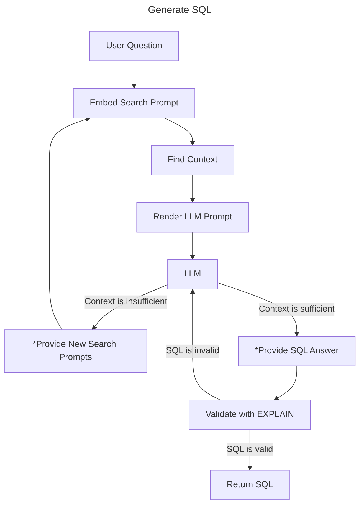

# Semantic Catalog

## What is "text-to-sql"?

Text-to-SQL is a natural language processing technology that converts questions made in human language into SQL queries
that you execute in relational databases such as PostgreSQL. Text-to-SQL is a tool that enables non-technical users to
interact with data and database systems using everyday language in the place of complex SQL syntax.

## Want to jump right in?

See [How do I get started?](#how-do-i-get-started)

## The Struggle

Why can't we **just** ask an LLM to write the query?

- The main problem is database schemas by themselves are often missing the context that would be necessary to answer a question. For example, is the `orders` table referring to customer orders or purchase orders?
- LLMs are non-deterministic and unpredictable
- They hallucinate tables, columns, and logic
- Yet precision is critical when querying real data
- Small errors can break trust in production systems

Okay, what if we give it the full context of the database? 
We could dump the entire schema to the LLM prompt, add comments and some sample data.
But even that may not work because the **schema may miss crucial context** about business logic and table/column names may not have enough semantic context to allow the LLM to make good decisions.
And, as schemas get larger, this approach will consume too many tokens, too much time, and risks leading the LLM astray with irrelevant details.

## How do you write a SQL query?

**How do human experts approach writing SQL?**

- Understand the question being asked, the *intent*
- Explore the database structure: schemas (DDL), comments
- Inspect the data: sample rows, distributions, NULL patterns
- Infer meaning from data patterns (e.g. deleted_at IS NULL means the row is "active")
- Combine all of the above with context about the company: business rules, logic, etc.
- Look at the application code and logic.
- Ask other teammates for information.

LLMs are capable of writing valid SQL syntax without further training on the SQL language. However, knowing SQL is not
enough to author queries that accurately answer business questions.

**What does an LLM need to replicate the human expert?**

- The *intent*: the user’s natural language question.  
- The *structure*: access to DDL and descriptions.
- The *data semantics*: sample rows and facts to ground meaning.
- The *validators*: tools to check syntax, object existence, and logical coherence.
- And then a way to *bridge syntax with semantics*.

LLMs know the language. The postgres catalog contains the definitions of the schema and data. The semantic catalog acts
as a bridge between the structural definitions and a human-level understanding in natural language. Furthermore, the semantic catalog
leverages the Postgres planner to **validate the queries written by the LLM**.

For demanding applications, we use the semantic catalog to include only the schema and sample data that is *relevant* to
the question posed. This light-touch solution reduces the number of tokens consumed and avoids introducing irrelevant
details to the LLM.

Even with the perfect context, an LLM may hallucinate tables, columns, functions, etc. creating an invalid SQL query.
By automatically running `EXPLAIN` on the generated SQL, we utilize the realtime state of the database to verify the query.
If the query is invalid, `EXPLAIN` returns detailed error information that is fed back to the LLM with a prompt for correction.

## Creating an Agent that can write accurate queries

We need two tools to create an LLM agent that can write SQL:
1. "search for more context"
2. "provide a SQL statement"

The LLM "knows" whether it has enough information to answer confidently, and if it doesn't have enough, it knows where the gaps in context are.
Giving it a tool to search with allows it to **agentically** build the context it needs.

When the LLM provides a SQL statement, we automatically validate it, checking the work of a non-deterministic LLM with a deterministic planner.
We do this using Postgres’s `EXPLAIN` statement, where we ask the database to return a query plan. That plan gives us:

- **Syntax validation**: Did the query parse correctly?
- **Object validation**: Do all referenced schemas, tables, columns, views, procedures, exist
- **Estimated cost**: How many rows are expected to be scanned? What operations will be performed?

This is performed against your actual database via its actual query planner. So, it’s the ground truth and prevents hallucinations.
But because we’re just doing query planning, rather than query execution, it’s both inexpensive and safe.

As pseudocode:

```
1. Get user question
2. Find related context (RAG)
3. Ask the LLM to either:
   a. Respond with a SQL query
      GOTO: 4
   b. Respond with search parameters for more context
      GOTO: 2
4. Validate the SQL query with `EXPLAIN`
   a. If valid
      RETURN SQL query
   b. If NOT valid
      Append error info to the prompt and GOTO: 3
```

Or as a diagram:



`*` items are tools called by the LLM

BUT how do we **find context**?

### The semantic catalog: how we provide context

A semantic catalog is a comprehensive knowledge repository that bridges the gap between natural language and database
structures. The term _semantic_ refers to the meaning or interpretation of language and symbols, focusing on the
relationships between words, phrases, and concepts rather than just their literal definitions. The semantic catalog is
a layer that enriches raw database objects with meaningful context that natural language processing models can leverage.

The semantic catalog consists of the following components:

- **Database objects**: with natural language descriptions that provide human-readable context for technical elements such
   as tables, columns, and functions. This mapping helps the system understand what users mean when they reference
   business concepts rather than technical database terms.
- **SQL examples**: paired with natural language descriptions that demonstrate how specific questions translate into query
   structures.
- **Facts**: expressed as natural language statements about the dataset/schema, facts provide additional domain knowledge
   that might not be explicitly encoded in the database structure but is crucial for understanding user intent.

We generate vector embeddings of the database objects, sql examples, and facts.
With these embeddings, your semantic catalog enables vector similarity searches that can retrieve relevant
context when processing new queries. This retrieval-augmented generation (RAG) approach ensures that when constructing
SQL queries from natural language inputs, the agent has access to the most pertinent information about your database
structure, usage patterns, and domain knowledge.

### What does the context "look like"?

LLMs operate on text. We have to render the relevant context from the semantic catalog to present it to the LLM.
It turns out that SQL is the perfect format for this! LLMs are already extensively trained on the SQL language,
and there is no more precise way to describe database contents. We can describe structures, semantic descriptions, and sample data all with SQL.

Below is an example of the rendering we provide for a table.

```sql
<table id="76">
CREATE TABLE postgres_air.flight
( flight_id integer NOT NULL nextval('postgres_air.flight_flight_id_seq'::regclass)
, flight_no text NOT NULL
, scheduled_departure timestamp with time zone NOT NULL
, scheduled_arrival timestamp with time zone NOT NULL
, departure_airport character(3) NOT NULL
, arrival_airport character(3) NOT NULL
, status text NOT NULL
, aircraft_code character(3) NOT NULL
, actual_departure timestamp with time zone
, actual_arrival timestamp with time zone
, update_ts timestamp with time zone
);
ALTER TABLE postgres_air.flight ADD CONSTRAINT flight_pkey PRIMARY KEY (flight_id);
ALTER TABLE postgres_air.flight ADD CONSTRAINT aircraft_code_fk FOREIGN KEY (aircraft_code) REFERENCES postgres_air.aircraft(code);
ALTER TABLE postgres_air.flight ADD CONSTRAINT arrival_airport_fk FOREIGN KEY (arrival_airport) REFERENCES postgres_air.airport(airport_code);
ALTER TABLE postgres_air.flight ADD CONSTRAINT departure_airport_fk FOREIGN KEY (departure_airport) REFERENCES postgres_air.airport(airport_code);

COMMENT ON TABLE postgres_air.flight IS $$The flight table tracks scheduled and actual flight details, including timing, status, airports, and aircraft used.$$;
COMMENT ON COLUMN postgres_air.flight.flight_id IS $$A unique identifier for each flight.$$;
COMMENT ON COLUMN postgres_air.flight.flight_no IS $$The flight number assigned to the flight.$$;
COMMENT ON COLUMN postgres_air.flight.scheduled_departure IS $$Scheduled departure time for the flight.$$;
COMMENT ON COLUMN postgres_air.flight.scheduled_arrival IS $$Scheduled arrival time for the flight.$$;
COMMENT ON COLUMN postgres_air.flight.departure_airport IS $$IATA code of the departure airport.$$;
COMMENT ON COLUMN postgres_air.flight.arrival_airport IS $$IATA code of the arrival airport.$$;
COMMENT ON COLUMN postgres_air.flight.status IS $$The status of the flight, such as 'Delayed' or 'On Time.'$$;
COMMENT ON COLUMN postgres_air.flight.aircraft_code IS $$Aircraft code identifying the model used for the flight.$$;
COMMENT ON COLUMN postgres_air.flight.actual_departure IS $$The actual time of departure, if available.$$;
COMMENT ON COLUMN postgres_air.flight.actual_arrival IS $$The actual time of arrival, if available.$$;
COMMENT ON COLUMN postgres_air.flight.update_ts IS $$Timestamp of the last update to the flight record.$$;

COPY (SELECT * FROM "postgres_air"."flight" LIMIT 3) TO STDOUT WITH (FORMAT TEXT, HEADER true);
/*
flight_id       flight_no       scheduled_departure     scheduled_arrival       departure_airport       arrival_airport status  aircraft_code   actual_departure        actual_arrival  update_ts
181960  4946    2024-07-12 15:05:00+00  2024-07-12 15:55:00+00  MEX     MLM     Delayed CR2     2024-07-12 17:06:43.32+00       2024-07-12 15:46:30.24+00       2024-07-12 15:45:43.32+00
203092  2167    2024-07-16 00:35:00+00  2024-07-16 07:35:00+00  IAD     DUB     Delayed 773     2024-07-16 02:37:35.52+00       2024-07-16 07:32:35.64+00       2024-07-16 01:09:35.52+00
203296  2941    2024-07-21 17:25:00+00  2024-07-21 19:05:00+00  ORD     ICT     Delayed 773     2024-07-21 19:28:52.2+00        2024-07-21 18:56:11.52+00       2024-07-21 18:12:52.2+00
*/
</table>
```

### Features

* The library can automatically generate descriptions of database objects
* The contents of a semantic catalog can be exported to and imported from YAML
* You can search the semantic catalog using natural language prompts
* You can install the semantic catalog in a different database from the one you are generating SQL statements for.
* You can manage multiple, independent semantic catalogs in a single database.
* For A/B testing, you can create multiple embedding configurations on a single semantic catalog.

## How do I get started?

- [I want to create a semantic catalog for my database.](quickstart-your-data.md)
- [I want a walkthrough of capabilities on demo data.](quickstart-demo-data.md)
- Check out the [CLI reference.](cli.md)
