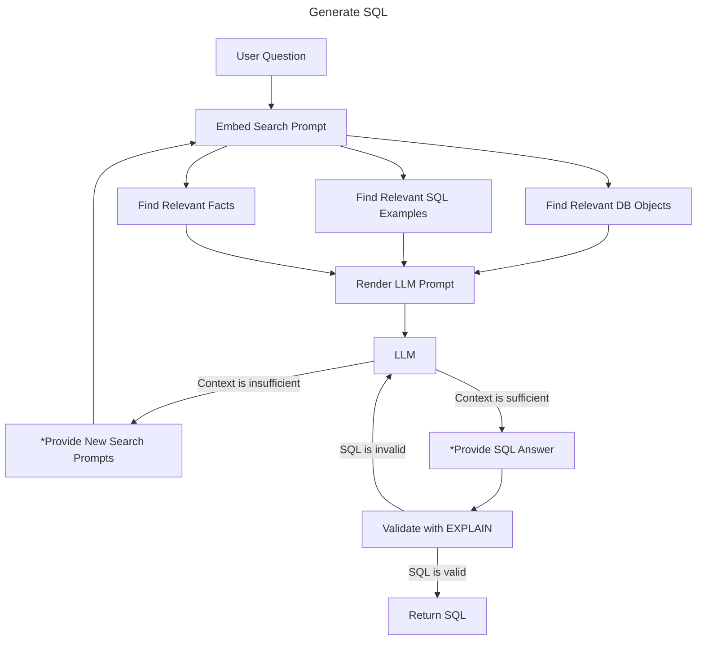

# Semantic Catalog Quickstart

## What is "text-to-sql"?

Text-to-SQL is a natural language processing technology that converts plain human language queries into SQL queries that can be executed against relational databases like PostgreSQL. It acts as a bridge between non-technical users and database systems, allowing them to interact with data using everyday language rather than having to write complex SQL syntax.

## Prompting an LLM for text-to-sql

LLMs are trained on the SQL language. They are capable of writing valid SQL queries without further training on the language itself. However, knowing the language is not enough to author queries that accurately answer business questions. To do this, one also needs knowledge of the schema's structures and an understanding of the data in these structures.

### The three ingredients to authoring a query:

1. knowledge of the SQL language
2. knowledge of the database schema (structures)
3. understanding of the data's format and meaning

We have to provide ingredients 2 and 3 to the LLM in a prompt.

We could dump the entire schema and data to SQL and include it in the prompt. For very small databases, this might work. As schemas get larger, this approach will consume too many tokens, too much time, and risks leading the LLM astray with irrelevant details.

For demanding applications, we only want to include in the context the schema and sample data that is *relevant* to the question posed.

## The "Semantic Catalog"

A semantic catalog serves as a comprehensive knowledge repository that bridges the gap between natural language and database structures. The term "semantic" refers to the meaning or interpretation of language and symbols, focusing on the relationships between words, phrases, and concepts rather than just their literal definitions. The semantic catalog is a layer that enriches raw database objects with meaningful context that natural language processing models can leverage.

The semantic catalog consists of three components:

1. Database objects with natural language descriptions provide human-readable context for technical elements like tables, columns, and relationships. This mapping helps the system understand what users mean when they reference business concepts rather than technical database terms.
2. SQL examples paired with natural language descriptions demonstrate how specific questions translate into query structures.
3. Facts expressed as natural language statements about the dataset/schema provide additional domain knowledge that might not be explicitly encoded in the database structure but is crucial for understanding user intent.

By embedding these components, your semantic catalog enables vector similarity searches that can retrieve relevant context when processing new queries. This retrieval-augmented generation (RAG) approach ensures the text-to-SQL system has access to the most pertinent information about your database structure, usage patterns, and domain knowledge when constructing SQL queries from natural language inputs.

### Semantic Catalog Features

* The semantic catalog can be in a database other than the database you are generating SQL statements for.
* You can manage multiple, independent semantic catalogs in a single database
* A single semantic catalog can have multiple embedding configurations for A/B testing

## Quickstart Example

### Overview

We are going to use an open source postgres database named "postgres air" to demonstrate SQL generation.

We will use pgai to find database objects in the postgres air database and automatically generate natural language descriptions using an LLM.
We will then create a semantic catalog in another postgres database, import our descriptions, and embed them.

Once our semantic catalog is loaded with embedded descriptions, we can start generating SQL to answer our questions.

## Prerequisites

* [git](https://git-scm.com/downloads)
* [uv](https://docs.astral.sh/uv/getting-started/installation/)
* [docker](https://www.docker.com/products/docker-desktop/)
* an OpenAI key

## Installation

```bash
git clone https://github.com/timescale/pgai.git -b jgpruitt/semantic-catalog
cd pgai/projects/pgai
uv sync
source .venv/bin/activate
pgai --version
```

## Steps

### 1. Run a postgres container

```bash
docker run -d --name postgres-air --hostname postgres-air \
    -p 127.0.0.1:5555:5432 \
    -e POSTGRES_HOST_AUTH_METHOD=trust \
    pgvector/pgvector:pg17
```

### 2. Load the postgres_air dataset

Download the `postgres_air_2024.sql.zip` file from [https://github.com/hettie-d/postgres_air](https://drive.google.com/file/d/1C7PVxeYvLDr6n_7qjdA2k0vahv__jMEo/view?usp=drive_link). Then, unzip it to `postgres_air_2024.sql` and put it in your current directory.

Load the postgres_air dataset. Wait for this process to finish.

```bash
psql -d "postgres://postgres@localhost:5555/postgres" -v ON_ERROR_STOP=1 -f postgres_air_2024.sql
```

### 3. Create a `.env` file

Create a `.env` file in the current working directory and define some environment variables in it.

```
OPENAI_API_KEY="sk-your-key-goes-here"
TARGET_DB="postgres://postgres@localhost:5555/postgres"
```

### 4. Generate descriptions of the postgres_air database

Then, find database objects in the postgres_air database, generate descriptions for them using an LLM,
and then output a yaml file to be loaded in a semantic catalog.

```bash
pgai semantic-catalog describe -f descriptions.yaml
```

Take a look at the yaml file. You can manually edit the descriptions to improve them if you wish.

### 5. Create a semantic catalog

Next, create a semantic catalog in the database.

By default, the semantic catalog is named "default" (you can have more than one),
and a default embedding configuration is created using OpenAI's `text-embedding-3-small` (you can have more than one).

```bash
pgai semantic-catalog create
```

### 6. Import the descriptions

Now, load and vectorize the descriptions you generated into the semantic catalog.

```bash
pgai semantic-catalog import -f descriptions.yaml
```

### 7. Search the semantic catalog

With a semantic catalog loaded with descriptions, we can now perform a semantic search using a natural language prompt.
This will find database object, SQL examples, and/or facts that are relevant to the prompt provided.

```bash
pgai semantic-catalog search -p "Which passengers have experienced the most flight delays in 2024?"
```

To see how these search results would be rendered to a prompt for an LLM, pass the `--render` flag.

```bash
pgai semantic-catalog search -p "Which passengers have experienced the most flight delays in 2024?" --render
```

### 8. Generate SQL statements

Now, you can generate SQL on the command line!

```bash
pgai semantic-catalog generate-sql -p "Which passengers have experienced the most flight delays in 2024?"
```

Or in your Python application!

```python
import os
import logging
import asyncio
import psycopg
from dotenv import find_dotenv, load_dotenv

import pgai.semantic_catalog as sc

load_dotenv(dotenv_path=find_dotenv(usecwd=True))

logging.basicConfig(
            level="INFO",
            format="%(asctime)s - %(name)s - %(levelname)s - %(message)s",
            handlers=[logging.StreamHandler()],
        )

async def main():
    async with await psycopg.AsyncConnection.connect(os.environ["TARGET_DB"]) as con:
        # get a handle to our "default" semantic catalog
        catalog = await sc.from_name(con, "default")
        # generate sql
        response = await catalog.generate_sql(
            con,
            con,
            "openai:gpt-4.1",
            "Which passengers have experienced the most flight delays in 2024?",
        )

        print(response.sql_statement)


if __name__ == "__main__":
    asyncio.run(main())

```

## How does SQL generation work?



`*` items are tools called by the LLM

## More questions to try

```
┌────┬──────────────┬───────────────────────────────────────────────────────────────────────────────────────────────────────────────────────────────────────────────────────┐
│ id │  complexity  │                                                                       question                                                                        │
├────┼──────────────┼───────────────────────────────────────────────────────────────────────────────────────────────────────────────────────────────────────────────────────┤
│  1 │ easy         │ What is the total number of aircraft in the fleet?                                                                                                    │
│  2 │ easy         │ How many international airports are in the database?                                                                                                  │
│  3 │ easy         │ What is the average flight duration for all flights?                                                                                                  │
│  4 │ easy         │ Which airports are located in Tokyo?                                                                                                                  │
│  5 │ easy         │ What is the maximum range of any aircraft in the fleet?                                                                                               │
│  6 │ easy         │ Which aircraft model has the highest velocity?                                                                                                        │
│  7 │ easy         │ List all flights departing from New York's JFK airport in July 2024.                                                                                  │
│  8 │ easy         │ What are the names of all airports located in the United States?                                                                                      │
│  9 │ easy         │ How many flights were delayed in June 2024?                                                                                                           │
│ 10 │ easy         │ What are the top 10 cities with the most airports?                                                                                                    │
│ 11 │ easy         │ What is the average age of passengers who traveled in August 2024?                                                                                    │
│ 12 │ easy         │ How many Boeing aircraft are in the fleet?                                                                                                            │
│ 13 │ easy         │ Which airports are located in Asia?                                                                                                                   │
│ 14 │ easy         │ How many unique aircraft models are in the fleet?                                                                                                     │
│ 15 │ easy         │ Which passenger has the highest number of award points in the frequent flyer program?                                                                 │
│ 16 │ easy         │ Which airports are located in Europe?                                                                                                                 │
│ 17 │ easy         │ What is the most common aircraft model used by Postgres Air?                                                                                          │
│ 18 │ easy         │ Which passengers have precheck status on their boarding passes?                                                                                       │
│ 19 │ easy         │ How many flights have an actual arrival time earlier than the scheduled arrival time?                                                                 │
│ 20 │ easy         │ What is the average delay time in minutes for flights departing from LAX airport in July 2024?                                                        │
│ 21 │ easy         │ Which flights had the longest delays in August 2024?                                                                                                  │
│ 22 │ easy         │ What percentage of flights arrived on time in the first half of 2024?                                                                                 │
│ 23 │ intermediate │ How many flights were operated by each aircraft model in Q2 2024?                                                                                     │
│ 24 │ easy         │ List all the booked seats for flight number 4946 from MEX to MLM on July 7th, 2024.                                                                   │
│ 25 │ intermediate │ Which route (origin-destination pair) had the most flights in the first half of 2024?                                                                 │
│ 26 │ easy         │ Which frequent flyers have reached level 4 status with more than 100,000 award points?                                                                │
│ 27 │ intermediate │ How many passengers flew from Tokyo to Delhi in the first half of 2024?                                                                               │
│ 28 │ intermediate │ Which aircraft model was most frequently used for transatlantic flights in 2024?                                                                      │
│ 29 │ intermediate │ What is the average age of passengers traveling on international flights?                                                                             │
│ 30 │ hard         │ Which frequent flyers have traveled on more than 10 different flights in 2024?                                                                        │
│ 31 │ intermediate │ What is the total number of passengers who traveled between London and Paris in July 2024?                                                            │
│ 32 │ easy         │ Which continents have the most international airports?                                                                                                │
│ 33 │ intermediate │ What is the average booking price for flights to European destinations?                                                                               │
│ 34 │ intermediate │ What is the distribution of aircraft types used for domestic versus international flights?                                                            │
│ 35 │ intermediate │ Find the busiest time of day for departures from each major international airport.                                                                    │
│ 36 │ intermediate │ Which booking had the most passengers in the second quarter of 2024?                                                                                  │
│ 37 │ intermediate │ What is the average delay time for flights to Tokyo compared to flights to New York?                                                                  │
│ 38 │ hard         │ Which passenger has flown the most miles in the first half of 2024?                                                                                   │
│ 39 │ intermediate │ What is the average number of days between booking and flight departure for international flights?                                                    │
│ 40 │ hard         │ Which passengers have traveled on both domestic and international flights in the same month?                                                          │
│ 41 │ hard         │ How many passengers have flown on more than three different aircraft types in 2024?                                                                   │
│ 42 │ easy         │ What are the most common first names among frequent flyers?                                                                                           │
│ 43 │ intermediate │ Which city pairs have the most flights between them in July 2024?                                                                                     │
│ 44 │ intermediate │ For each continent, what is the average flight delay time in minutes?                                                                                 │
│ 45 │ intermediate │ What is the average number of passengers per booking?                                                                                                 │
│ 46 │ intermediate │ Which aircraft model has the best on-time arrival performance?                                                                                        │
│ 47 │ intermediate │ Which passengers have made bookings but never actually flown?                                                                                         │
│ 48 │ intermediate │ Which routes have the highest average ticket prices?                                                                                                  │
│ 49 │ intermediate │ What is the percentage of children (under 12) traveling on international flights versus domestic flights?                                             │
│ 50 │ intermediate │ Which routes have the highest cancellation rates in 2024?                                                                                             │
│ 51 │ hard         │ What is the average connecting time between flights for passengers traveling from Asia to South America?                                              │
│ 52 │ hard         │ How many passengers have flown with Postgres Air more than 5 times but are not frequent flyer members?                                                │
│ 53 │ intermediate │ What is the most common departure day of the week for international flights?                                                                          │
│ 54 │ intermediate │ Who are the top 10 frequent flyers who flew in Q2 2024 that have the most award points?                                                               │
│ 55 │ hard         │ What is the average age difference between passengers traveling together on the same booking?                                                         │
│ 56 │ intermediate │ What is the distribution of flight durations across different aircraft models?                                                                        │
│ 57 │ intermediate │ What is the average number of boarding passes issued per flight?                                                                                      │
│ 58 │ intermediate │ Which airports have the highest percentage of on-time departures in the summer of 2024?                                                               │
│ 59 │ intermediate │ What is the average velocity of aircraft flying international routes compared to domestic routes?                                                     │
│ 60 │ hard         │ What is the total flight distance traveled by each aircraft in the fleet during 2024?                                                                 │
│ 61 │ intermediate │ What's the most popular seat position (window, middle, aisle) chosen by passengers on long-haul flights?                                              │
│ 62 │ hard         │ Which frequent flyers have traveled on flights with all three aircraft models (Airbus 340, Airbus 380, and Boeing 777-300)?                           │
│ 63 │ hard         │ Which passengers traveled with family members (same last name) on the same flight in June 2024?                                                       │
│ 64 │ easy         │ Which frequent flyers have the same first name but different last names?                                                                              │
│ 65 │ intermediate │ How many passengers over 65 years old flew on international flights in March 2024?                                                                    │
│ 66 │ intermediate │ What percentage of bookings are made by frequent flyers versus regular customers?                                                                     │
│ 67 │ intermediate │ What is the median age of passengers flying to Asian destinations?                                                                                    │
│ 68 │ intermediate │ How many flights were canceled due to maintenance issues in the first quarter of 2024?                                                                │
│ 69 │ hard         │ How many passengers flew between Delhi and Tokyo direct versus with connections in 2024?                                                              │
│ 70 │ intermediate │ What is the average daily revenue from bookings in May 2024?                                                                                          │
│ 71 │ hard         │ What percentage of international flights have at least one passenger under 10 years old?                                                              │
│ 72 │ intermediate │ What is the average booking price for flights departing from Tokyo airports?                                                                          │
│ 73 │ intermediate │ How many flights depart from each continent during weekends (Saturday and Sunday) versus weekdays?                                                    │
│ 74 │ intermediate │ What is the average age of frequent flyers in each membership level?                                                                                  │
│ 75 │ hard         │ Which passengers have experienced the most flight delays in 2024?                                                                                     │
│ 76 │ hard         │ What is the total number of flights between the top 5 busiest airports in the database?                                                               │
│ 77 │ intermediate │ Which flight had the highest number of passengers over 70 years old?                                                                                  │
│ 78 │ hard         │ What is the most profitable route based on average booking price in 2024?                                                                             │
│ 79 │ hard         │ Which passengers have the longest average flight time in the first half of 2024?                                                                      │
│ 80 │ hard         │ Which flight routes have the highest ratio of business class (seats with row less than 10) to economy class passengers for aircraft in class 0 and 1? │
│ 81 │ easy         │ What is the average age of all passengers who have booked flights with Postgres Air?                                                                  │
│ 82 │ hard         │ How many passengers traveled with their children (passengers under 18 with same last name) in August 2024?                                            │
│ 83 │ hard         │ What percentage of flights arriving in Tokyo have at least one passenger over 60 years old?                                                           │
│ 84 │ hard         │ Which flights had the highest percentage of no-show passengers in August 2024?                                                                        │
│ 85 │ hard         │ Which passenger has flown the most total miles in September 2024?                                                                                     │
│ 86 │ hard         │ Which routes have the highest proportion of business travelers (indicated by work phone numbers) in August 2024?                                      │
└────┴──────────────┴───────────────────────────────────────────────────────────────────────────────────────────────────────────────────────────────────────────────────────┘
(86 rows)
```
